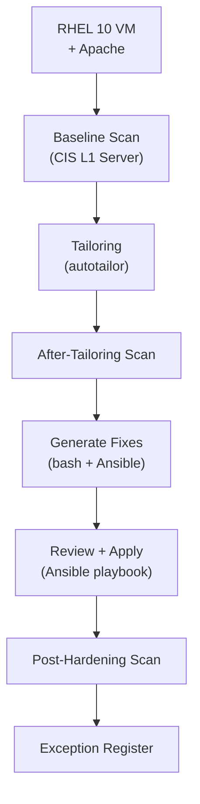

# OpenSCAP RHEL Hardening Lab

> **Series:** Security & Compliance — Lab 1  
> **Platform:** Red Hat Enterprise Linux 10.1 (Coughlan)  
> **Tools:** OpenSCAP 1.4.3, scap-security-guide, Ansible, Lynis  
> **Profile:** CIS Benchmark Level 1 — Server  

## Project Goal

Hands-on lab demonstrating a full **security compliance audit and hardening cycle** on RHEL 10 using OpenSCAP. The project covers:

- Running a baseline CIS compliance scan on a fresh RHEL 10 install
- Analyzing the audit report and understanding failure categories
- Creating a tailoring file to customize the CIS profile
- Applying automated remediation (Ansible playbook)
- Re-running the scan and measuring improvement
- Documenting exceptions with formal justification

## Lab Scenario

A freshly installed RHEL 10 server hosts a simple Apache web application. The system must meet **CIS Benchmark Level 1 (Server)** compliance.

The lab walks through the full audit → tailoring → remediation → re-audit → exceptions cycle.

## Project Structure

```
openscap-rhel-hardening-lab/
├── README.md                    # This file
├── LAB_RULES.md                 # Lab rules, conventions, methodology
├── docs/
│   ├── 01-theory.md             # OpenSCAP theory, SCAP standard, profiles
│   ├── 02-environment-setup.md  # VM preparation, RHEL install, Apache setup
│   ├── 03-baseline-audit.md     # First scan — commands, results, analysis
│   ├── 04-tailoring.md          # Profile customization — tailoring file
│   ├── 05-remediation.md        # Hardening — fix generation, review, Ansible
│   ├── 06-post-audit.md         # Second scan — comparison, improvements
│   ├── 07-exceptions.md         # Exception register — formal waivers
│   ├── 08-summary.md            # Conclusions, lessons learned, next steps
│   └── 09-lynis-comparison.md   # Lynis audit — cross-tool comparison
├── scripts/
│   ├── 01-install-packages.sh   # Install OpenSCAP + dependencies
│   ├── 02-setup-apache.sh       # Install & configure Apache + test page
│   ├── 03-run-baseline-scan.sh  # Run first CIS audit (baseline)
│   ├── 04-create-tailoring.sh   # Create tailoring file with autotailor
│   ├── 05-generate-fixes.sh     # After-tailoring scan + generate fixes
│   ├── 06-run-post-scan.sh      # Run post-hardening audit
│   ├── 07-apply-remediation.sh  # Apply Ansible remediation playbook
│   ├── 08-compare-results.sh    # Compare baseline vs post-hardening
│   └── 09-run-lynis.sh          # Run Lynis audit for comparison
├── remediation/
│   ├── remediation.sh           # Generated bash remediation script
│   └── remediation.yml          # Generated Ansible remediation playbook
├── ansible/
│   └── inventory.ini            # Ansible inventory for lab VM
├── reports/                     # Audit reports (HTML) — for reference
│   └── .gitkeep
└── assets/                      # Screenshots, diagrams
    └── .gitkeep
```

## Prerequisites

- RHEL 10 VM (Minimal Install)
- Active Red Hat subscription (free Developer Subscription is fine)
- Root or sudo access
- Internet connectivity for package installation
- min. 2 GB RAM, min. 20 GB disk

## Architecture



## Quick Start

```bash
# 1. Clone the repo
git clone https://github.com/barfrakud/openscap-rhel-hardening-lab

# 2. Copy scripts to your RHEL 10 VM and run step by step:
sudo bash scripts/01-install-packages.sh
sudo bash scripts/02-setup-apache.sh
sudo bash scripts/03-run-baseline-scan.sh
sudo bash scripts/04-create-tailoring.sh
sudo bash scripts/05-generate-fixes.sh
sudo bash scripts/07-apply-remediation.sh
sudo bash scripts/06-run-post-scan.sh
sudo bash scripts/08-compare-results.sh

# See docs/ for detailed walkthrough of each step
```

## Results

| Metric                 | Baseline Scan | Post-Hardening Scan | Change       |
|------------------------|---------------|---------------------|--------------|
| **Score**              | 73.99%        | **95.45%**          | +21.46 pp    |
| Rules pass             | 170           | 283                 | +113         |
| Rules fail             | 119           | 5                   | −114         |
| Rules notapplicable    | 32            | 31                  | −1           |
| **Fix rate**           |               |                     | **95.8%**    |

**Tailoring:** 3 rules disabled, 3 values refined  
**Exceptions:** 5 active (GRUB2 password, SSH AllowUsers, password last change, journald+rsyslog, journal-upload)  
**Remediation:** Ansible playbook — ok=1193, changed=155, failed=0

## OpenSCAP vs Lynis

| | OpenSCAP | Lynis |
|---|---|---|
| **Podejście** | Compliance-driven (pass/fail vs standard) | Advisory-driven (scoring + sugestie) |
| **Wynik po hardeningu** | **95.45%** (CIS L1 score) | **72**/100 (Hardening Index) |
| **Przeznaczenie** | Formalny audyt, raporty dla audytorów, auto-remediacja | Szybka ocena, odkrywanie problemów poza zakresem CIS |
| **Unikalne znaleziska** | GRUB2 password, PAM faillock, journald/rsyslog konflikt | mod_evasive, modsecurity, malware scanner, kompilator |

**Wniosek:** OpenSCAP odpowiada na pytanie *"czy system jest zgodny ze standardem?"* — Lynis odpowiada na pytanie *"co jeszcze można poprawić?"*. Narzędzia uzupełniają się nawzajem.

## References

- [OpenSCAP Documentation](https://www.open-scap.org/documentation/)
- [SCAP Security Guide (SSG)](https://github.com/ComplianceAsCode/content)
- [CIS Benchmarks](https://www.cisecurity.org/cis-benchmarks)
- [DISA STIG](https://public.cyber.mil/stigs/)
- [Red Hat — Security Compliance](https://docs.redhat.com/en/documentation/red_hat_enterprise_linux/10/html/security_hardening/)

## License

MIT
