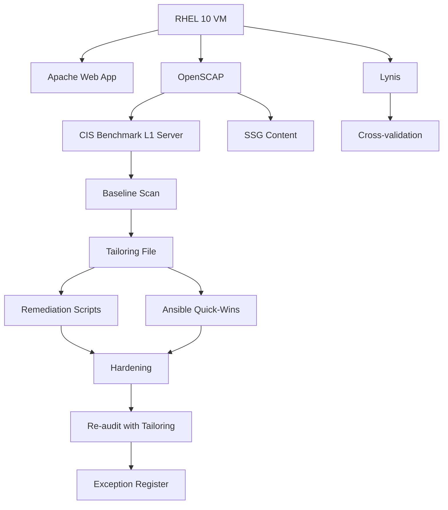

# OpenSCAP RHEL Hardening Lab

> **Series:** Security & Compliance — Lab 1  
> **Platform:** Red Hat Enterprise Linux 10  
> **Tools:** OpenSCAP, scap-security-guide, Ansible, Lynis  

## 🎯 Project Goal

Hands-on lab demonstrating a full **security compliance audit and hardening cycle** on RHEL 10 using OpenSCAP. The project covers:

- Running a baseline CIS compliance scan on a fresh RHEL 10 install
- Analyzing the audit report and understanding failure categories
- Creating a tailoring file to customize the CIS profile
- Applying automated remediation (bash scripts + Ansible)
- Re-running the scan and measuring improvement
- Documenting exceptions with formal justification
- Comparing results with Lynis for cross-validation
- Documenting findings and lessons learned

## 📋 Lab Scenario

A freshly installed RHEL 10 server hosts a simple Apache web application. The system must meet **CIS Benchmark Level 1 (Server)** compliance. 

The lab walks through the full audit → remediation → re-audit cycle.

## 🗂️ Project Structure

```
openscap-rhel-hardening-lab/
├── README.md                    # This file
├── LAB_RULES.md                 # Lab rules, conventions, methodology
├── docs/
│   ├── 01-theory.md             # OpenSCAP theory, SCAP standard, profiles
│   ├── 02-environment-setup.md  # VM preparation, RHEL install, Apache setup
│   ├── 03-baseline-audit.md     # First scan — commands, results, analysis
│   ├── 04-tailoring.md          # Profile customization — tailoring file
│   ├── 05-remediation.md        # Hardening steps, scripts, Ansible playbook
│   ├── 06-post-audit.md         # Second scan — comparison, improvements
│   ├── 07-exceptions.md         # Exception register — formal waivers
│   ├── 08-summary.md            # Conclusions, lessons learned, next steps
│   ├── 09-lynis-comparison.md   # Lynis audit — cross-tool comparison
│   └── glossary.md              # Key terms: XCCDF, OVAL, STIG, CIS, ARF...
├── scripts/
│   ├── 01-install-packages.sh   # Install OpenSCAP + dependencies
│   ├── 02-setup-apache.sh       # Install & configure Apache + sample page
│   ├── 03-run-baseline-scan.sh  # Run first CIS audit
│   ├── 04-create-tailoring.sh   # Create tailoring file for profile
│   ├── 05-generate-fixes.sh     # Generate remediation scripts from results
│   ├── 06-run-post-scan.sh      # Run second audit after hardening
│   ├── 08-compare-results.sh    # Compare baseline vs post-hardening results
│   └── 09-run-lynis.sh          # Run Lynis audit for comparison
├── ansible/
│   ├── remediation.yml          # Quick-wins hardening playbook (SSH, sysctl, services)
│   └── inventory.ini            # Ansible inventory for lab VM
├── reports/                     # Audit reports (HTML/XML) — gitignored
│   └── .gitkeep
└── assets/                      # Screenshots, diagrams for documentation
    └── .gitkeep
```

## 🔧 Prerequisites

- RHEL 10 VM (Minimal Install or Server)
- Active Red Hat subscription (free Developer Subscription is fine)
- Root or sudo access
- Internet connectivity for package installation
- ~2 GB RAM, ~20 GB disk recommended

## Architecture



## 🚀 Quick Start

```bash
# 1. Clone the repo
git clone https://github.com/barfrakud/openscap-rhel-hardening

# 2. Copy scripts to your RHEL 10 VM and execute step by step
# See docs/ for detailed walkthrough
```

## 📊 Expected Results

| Metric              | Baseline Scan | Post-Hardening Scan |
|----------------------|---------------|---------------------|
| CIS L1 Pass Rate     | ~40-60%       | ~85-95%             |
| CAT I Failures       | Several       | 0                   |
| Total Rules Checked  | ~150-200      | ~150-200            |

*(Actual numbers will be filled in during the lab)*

## 📚 References

- [OpenSCAP Documentation](https://www.open-scap.org/documentation/)
- [SCAP Security Guide (SSG)](https://github.com/ComplianceAsCode/content)
- [CIS Benchmarks](https://www.cisecurity.org/cis-benchmarks)
- [DISA STIG](https://public.cyber.mil/stigs/)
- [Red Hat — Security Compliance](https://docs.redhat.com/en/documentation/red_hat_enterprise_linux/10/html/security_hardening/)

## 📝 License

MIT
