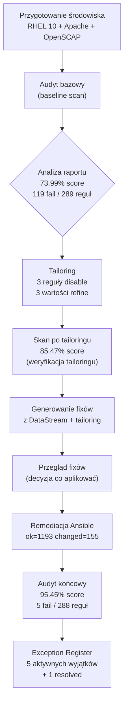

# 08 — Podsumowanie i wnioski

## Czego się nauczyłem

To laboratorium przeprowadza pełny cykl **audytu bezpieczeństwa i hardeningu** systemu
RHEL 10 z profilem CIS Level 1 Server. Ćwiczenie obejmuje: przygotowanie środowiska,
pierwszy skan (baseline), dostosowanie profilu (tailoring), automatyczną remediację
przez Ansible, audyt końcowy (post-hardening) oraz formalną dokumentację wyjątków.

### OpenSCAP jako narzędzie

OpenSCAP to open-source'owa implementacja standardu SCAP (NIST). Główne komponenty:

- **`oscap`** — CLI do skanowania systemów, generowania raportów i skryptów remediacyjnych
- **`scap-security-guide` (SSG)** — paczka z gotowymi profilami (CIS, STIG, PCI-DSS) w formacie DataStream XML
- **`autotailor`** (z `openscap-utils`) — narzędzie do tworzenia tailoring files na RHEL 10

Workflow pracy: DataStream XML → wybór profilu → `oscap xccdf eval` → raport HTML/XML/ARF.
Fixy: `oscap xccdf generate fix` generuje skrypty bash lub playbooki Ansible z wbudowanych
remediacji w DataStream, z uwzględnieniem tailoringu.

### Ściąga użytych komend OpenSCAP

**Informacje o profilach:**

```bash
oscap info /usr/share/xml/scap/ssg/content/ssg-rhel10-ds.xml
```

**Audyt (skan):**

```bash
oscap xccdf eval \
  --profile <PROFILE_ID> \
  [--tailoring-file <TAILORING.xml>] \
  --results <RESULTS.xml> \
  --results-arf <ARF.xml> \
  --report <REPORT.html> \
  <DATASTREAM.xml>
```

**Tailoring (RHEL 10):**

```bash
autotailor \
  --unselect=<RULE_ID> \
  --var-value=<VALUE_ID>=<VALUE> \
  --output <TAILORING.xml> \
  --tailored-profile-id <NEW_PROFILE_ID> \
  <DATASTREAM.xml> <BASE_PROFILE>
```

**Generowanie fixów (z DataStream + tailoring):**

```bash
oscap xccdf generate fix \
  --fix-type bash|ansible \
  --profile <TAILORED_PROFILE_ID> \
  --tailoring-file <TAILORING.xml> \
  --output <FIX.sh|FIX.yml> \
  <DATASTREAM.xml>
```

### Proces audytu i remediacji



### Profil CIS Level 1

- **Standard:** CIS Benchmark for RHEL 10
- **Profil ID:** `xccdf_org.ssgproject.content_profile_cis_server_l1`
- **Poziom:** Level 1 — podstawowy hardening, minimalne ryzyko wpływu na funkcjonalność
- **Zakres:** ~289 reguł obejmujących: uwierzytelnianie, SSH, kernel/sysctl, sieć, logowanie, uprawnienia plików, usługi, partycje
- **Dlaczego CIS L1 a nie STIG:** bardziej uniwersalny, stosowany komercyjnie, dobry punkt startowy edukacyjny

### Hardening w praktyce

**Wyniki — porównanie trzech etapów:**

| Metryka | Baseline | Po tailoringu | Po remediacji |
|---------|----------|---------------|---------------|
| Score   | 73.99%   | 85.47%        | **95.45%**    |
| Pass    | 170      | 341           | 283           |
| Fail    | 119      | 235           | **5**         |

**Kluczowe decyzje:**

- **Tailoring:** wyłączenie reguł partycji (`/tmp`, `/var`) i `package_httpd_removed` (Apache jest celową usługą)
- **Refine-value:** minlen hasła 8→14, maxage 365→90 dni, timeout sesji 600→900 s
- **Remediacja:** Ansible playbook (opcja B) — idempotentny, czytelny, skalowalny
- **Wyjątki:** 5 aktywnych (GRUB2 password, SSH AllowUsers, last password change, journald+rsyslog, journal-upload)

**Co naprawiono (114/119 reguł = 95.8% fix rate):**

| Kategoria              | Fail przed | Fail po | Naprawione |
|------------------------|-----------|---------|------------|
| Kernel & Sysctl        | 41        | 0       | 41         |
| Authentication         | 34        | 2       | 32         |
| SSH                    | 13        | 1       | 12         |
| Filesystem Permissions | 9         | 0       | 9          |
| Services               | 9         | 1       | 8          |
| Logging & Auditing     | 8         | 1       | 7          |
| Filesystem & Partitions| 4         | 0       | 4          |
| Network                | 1         | 0       | 1          |

## Co bym zrobił inaczej?

- **Partycje:** zaplanować layout dysków (`/tmp`, `/var`, `/var/log`, `/home` na osobnych partycjach) już podczas instalacji — naprawa post-factum wymaga reinstalacji
- **GRUB2 password:** ustawić hasło bootloadera (`grub2-setpassword`) jako krok manualny przed uruchomieniem Ansible
- **SSH AllowUsers:** skonfigurować `AllowUsers`/`AllowGroups` na etapie instalacji — wymaga decyzji o polityce dostępu
- **Architektura logowania:** zdecydować się na `journald` albo `rsyslog` przed hardeningiem, nie po (uniknięcie konfliktu EXC-005)
- **Snapshot VM:** robić snapshoty przed każdym etapem remediacji, nie tylko na początku

## Potencjalne rozszerzenia tego projektu

- [ ] Powtórzyć ćwiczenie z profilem **STIG** i porównać wyniki
- [ ] Zbudować **golden image** z hardeningiem w kickstarcie
- [ ] Zintegrować skanowanie z **CI/CD** (np. pipeline w GitLab/GitHub Actions)
- [ ] Zarządzanie compliance na większą skalę: **Red Hat Satellite / Insights**
- [ ] Hardening wielu serwerów z **Ansible roles** (ansible-lockdown)

## Umiejętności zdobyte

- [x] Instalacja i konfiguracja OpenSCAP na RHEL
- [x] Uruchamianie audytów SCAP z wybranym profilem
- [x] Analiza raportów HTML — interpretacja wyników
- [x] Tworzenie tailoring file — dostosowanie profilu do środowiska
- [x] Generowanie skryptów remediacyjnych (bash, Ansible)
- [x] Stosowanie remediacji Ansible playbook na systemie
- [x] Selektywne stosowanie hardeningu
- [x] Dokumentowanie wyjątków (Exception Register)
- [x] Porównywanie wyników przed/po hardeningu
- [x] Porównanie narzędzi: OpenSCAP vs Lynis
- [x] Rozumienie standardów CIS, STIG, PCI-DSS
- [x] Rozumienie formatu SCAP (XCCDF, OVAL, ARF)
