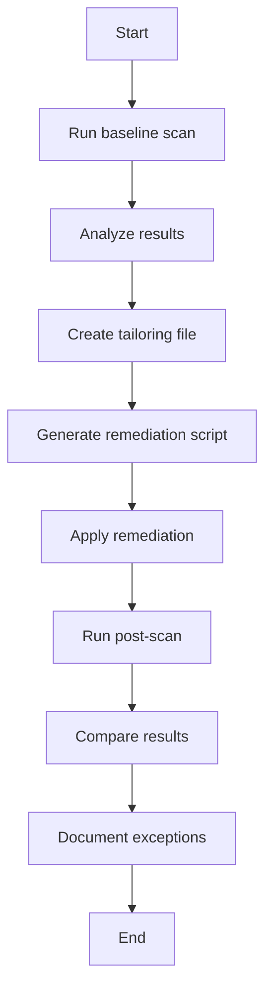

# 08 — Podsumowanie i wnioski

## Czego się nauczyłem

*(Opisz własnymi słowami co wyniosłeś z tego laboratorium)*

### OpenSCAP jako narzędzie

*(Opis koncepcji jak działa OpenSCAP oraz workflow pracy z Openscap)*

### Ściąga użytych komend dla OpenSCAP

*(Krótka lista używanych komend oscap z podziałem na etapy pracy z openscap)*

### Proces audytu i remediacji

### Profil CIS Level 1

-

### Hardening w praktyce

-

## Co bym zrobił inaczej?

-

## Potencjalne rozszerzenia tego projektu

- [ ] Powtórzyć ćwiczenie z profilem **STIG** i porównać wyniki
- [ ] Zbudować **golden image** z hardeningiem w kickstarcie
- [ ] Zintegrować skanowanie z **CI/CD** (np. pipeline w GitLab/GitHub Actions)
- [ ] Zarządzanie compliance na większą skalę: **Red Hat Satellite / Insights**
- [ ] Hardening wielu serwerów z **Ansible roles** (ansible-lockdown)

## Umiejętności zdobyte

- [x] Instalacja i konfiguracja OpenSCAP na RHEL
- [x] Uruchamianie audytów SCAP z wybranym profilem
- [x] Analiza raportów HTML — interpretacja wyników
- [x] Tworzenie tailoring file — dostosowanie profilu do środowiska
- [x] Generowanie skryptów remediacyjnych (bash, Ansible)
- [x] Pisanie Ansible playbooka do hardeningu (quick-wins)
- [x] Selektywne stosowanie hardeningu
- [x] Dokumentowanie wyjątków (Exception Register)
- [x] Porównywanie wyników przed/po hardeningu
- [x] Porównanie narzędzi: OpenSCAP vs Lynis
- [x] Rozumienie standardów CIS, STIG, PCI-DSS
- [x] Rozumienie formatu SCAP (XCCDF, OVAL, ARF)
